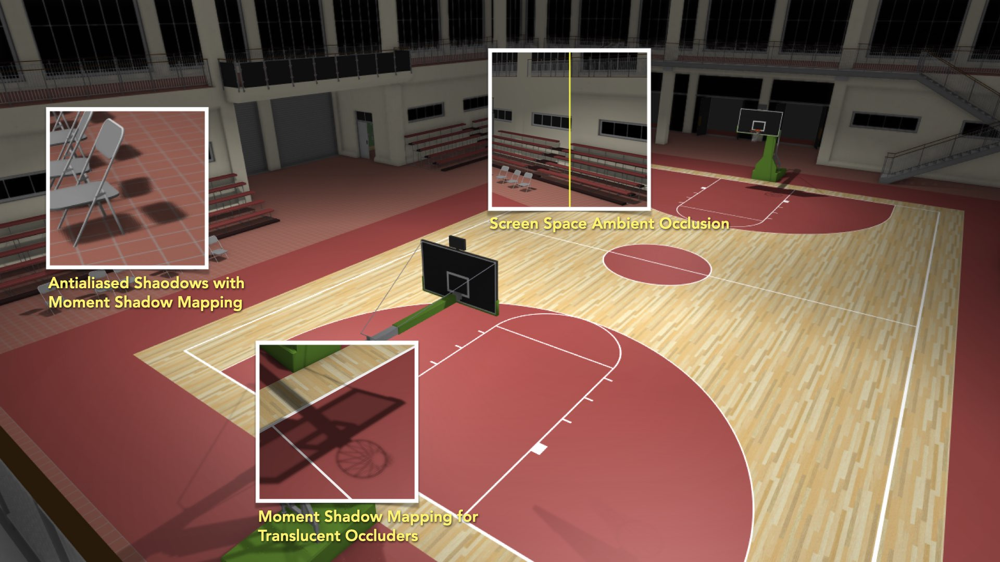

# Course Project 1 for *Computer Graphics*

This is the code repository for my first course project for *Computer Graphics*. I implemented two algorithms in this project: *Moment Shadow Mapping* and *Screen Space Ambient Occlusion*.

- [Download Slides](https://luost.me/files/2019/05/12/cg-project-1-slides.html)
- [Download Report](https://luost.me/files/2019/05/12/cg-project-1-report.html)

## Author

[Shitong Luo](https://luost.me), PKU.

## List of References

### Papers

- Peters, C., Münstermann, C., Wetzstein, N., & Klein, R. (2017). Improved Moment Shadow Maps for Translucent Occluders, Soft Shadows and Single Scattering. *Journal of Computer Graphics Techniques (JCGT)*, 6(1).
- Donnelly, W., & Lauritzen, A. (2006, March). Variance shadow maps. In *Proceedings of the 2006 symposium on Interactive 3D graphics and games* (pp. 161-165). ACM.
- Bavoil, L., & Sainz, M. (2008). Screen space ambient occlusion. *NVIDIA developer information: http://developers.nvidia.com*, 6.

### Web Pages

- MTL Files - Material Definitions for OBJ Files. https://people.sc.fsu.edu/~jburkardt/data/mtl/mtl.html
- LearnOpenGL - Assimp. https://learnopengl.com/Model-Loading/Assimp
- Tutorial 45: Screen Space Ambient Occlusion. http://ogldev.atspace.co.uk/www/tutorial45/tutorial45.html

### Open Source Projects

- GLFW. https://github.com/glfw/glfw
- glad. https://github.com/Dav1dde/glad
- Assimp. https://github.com/assimp/assimp
- 学校ジム Basketball / Multi Purpose Gym Building - Extreme High Detail Ver. 2 (SketchUp Model from 3D Warehouse). https://3dwarehouse.sketchup.com/model/ud2ae2c3a-b71a-48fd-bb2d-81020d3bbfc3/%E5%AD%A6%E6%A0%A1%E3%82%B8%E3%83%A0-Basketball-Multi-Purpose-Gym-Building-Extreme-High-Detail-Ver-2

  
